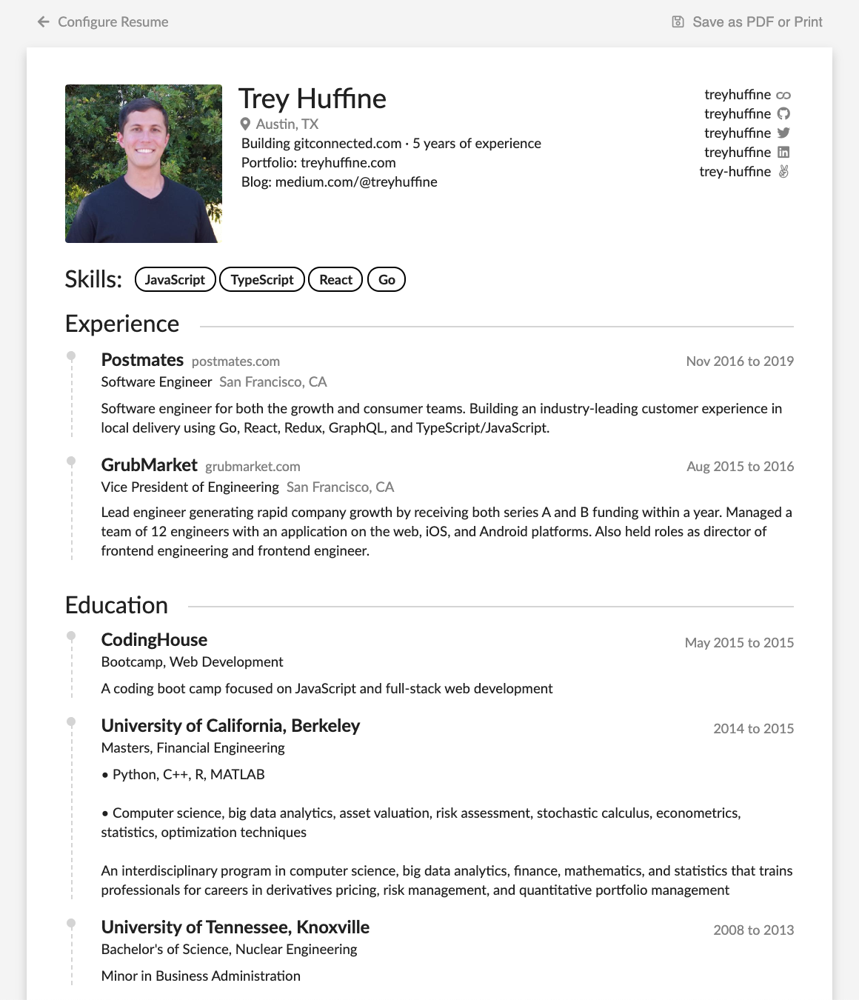

## NEW! - Automatically Generated Resumes
```
https://gitconnected.com/<YOUR_USERNAME>/resume
```
Ex. **[My Resume →](https://gitconnected.com/treyhuffine/resume)** (https://gitconnected.com/martin-raphael)


## Built using the gitconnected.com user portfolio API
The API at gitconnected.com provides the data, and each time you view a page, it retrieves the most recent version of your data. You can make changes to the website that hosts your portfolio without ever having to alter the code or re-deploy the site. Make use of your API ending point right now:

```
https://gitconnected.com/v1/portfolio/<YOUR_USERNAME>
```

6)

## Instructions
```
git clone https://github.com/martin-raphael/myportfolio.git

cd myportfolio-create-react-app
yarn install
yarn start
```

## Packages
- React (using create-react-app)
- Styled Components
- Carbon Design

